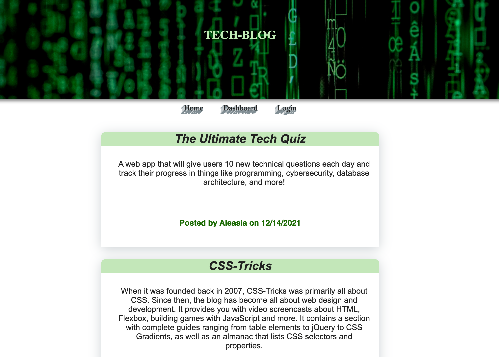

# Tech-Blog

## Description
Tech-Blog  is an web app that allow a user to make a post regarding any Tech subject. It supports account creation with secure password hashing and storage as well as the ability to login.Users can view all posts without needed to logged in and also they can go to their dashboards to see the posts they have made but this time only if they are logged in. They can also comment on posts if they are logged in. If the user is inactive for too long they will be logged out of their account.

## Core Skills

* Node.js
* Express.js
* JavaScript
* Sequelize
* Bcrypt
* Handlebars.js
* MVC
* MySQL
* Express Session
 

## Mock-Up

## Review

* Link to Aplication deployed
  * https://frozen-brook-84861.herokuapp.com/

* The URL of the GitHub repository 
* [Repository](https://github.com/Chrisolsen1993/Tech-Blog)
